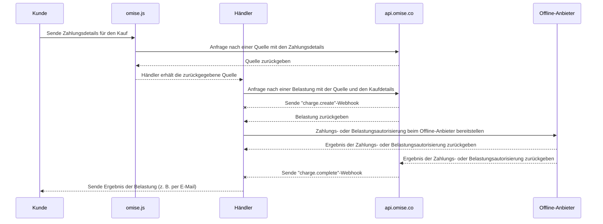

---
---

# Merchant-Presented Mode (C scan B)

<details>
  <summary><em>Behandelte Themen auf dieser Seite</em></summary>
- [Wie man es aktiviert](#how-to-enable)
- [Zahlungsablauf](#payment-flow)
- [Implementierung](#implementation)
  - [Erstellen einer Quelle](#creating-a-source)
  - [Erstellen einer Charge](#creating-a-charge)
  - [Erstellen einer Quelle und Charge](#creating-a-source-and-charge)
- [Einstellen des Ablaufs der Charge](#setting-the-charge-to-expire)
  - [Abschließen der Charge](#completing-the-charge)
- [Stornierungen und Rückerstattungen](#voids-and-refunds)
- [Grenzen](#limits)
- [Verwandte API-Dokumentation](#related-api-documentation)
- [Wie man den öffentlichen Schlüssel und den geheimen Schlüssel überprüft](#how-to-check-the-public-key-and-secret-key)

</details>

Akzeptieren Sie Zahlungen vor Ort von Alipay+ Nutzern über Ihr Point-of-Sale-System (POS) mit der Zahlungsmethode **Alipay+ Merchant-Presented Mode Payment (C scan B)**.

Dieser Leitfaden erklärt den Zahlungsablauf und beschreibt, wie er implementiert wird.

## Wie man es aktiviert

- **Unterstützte Länder:** Thailand, Singapur, Malaysia
- **Minimale API-Version:**  ```2017-11-02```

| Unterstützte Wallets | Thailand | Singapur | Malaysia |
|----------------------|----------|----------|----------|
| Alipay CN            | ✅        | ✅        |          |
| Alipay HK            | ✅        | ✅        | ✅        |
| KakaoPay             | ✅        | ✅        | ✅        |
| GCash                |          | ✅        | ✅        |
| Touch 'n Go          | ✅        | ✅        |          |
| TrueMoney            |          | ✅        | ✅        |

Um den **Merchant-Presented Mode (C scan B)** zu aktivieren, senden Sie eine E-Mail mit der Anfrage an [support@omise.co](mailto:support@omise.co). Sie müssen die neuen Geschäftsbedingungen überprüfen und akzeptieren.

## Zahlungsablauf

Kunden, die über den Merchant-Presented Mode (C scan B) zahlen, durchlaufen einen *offline* Zahlungsablauf. Das bedeutet, dass die Charge nach ihrer Erstellung nur "offline" autorisiert werden kann. In diesem Fall muss der Kunde den generierten QR-Code mit der unterstützten Wallet-App auf seinem Telefon scannen, um den Ablauf abzuschließen.

Ihr POS-Gerät sollte den QR-Code generieren, nachdem der Kunde den Merchant-Presented Mode (C scan B) als bevorzugte Zahlungsmethode ausgewählt hat.


❶ *Der Kunde öffnet eine unterstützte Alipay+ Wallet auf seinem Mobiltelefon.*  
❷ *Der Kunde scannt den im POS des Händlers angezeigten QR-Code.*  
❸ *Der Kunde überprüft die Zahlungsinformationen.*  
❹ *Der Kunde bestätigt die Zahlung.*  
❺ *Wenn die Zahlung erfolgreich ist, benachrichtigt die Wallet-Anwendung den Kunden.*

## Implementierung

Führen Sie die folgenden API-Anfragen aus, um eine Charge mit **Merchant-Presented Mode (C scan B)** zu erstellen:

1. Erstellen Sie eine neue Zahlungs- [Quelle](/sources-api#create) ( ```type``` :  ```alipayplus_mpm``` ) mit [Omise.js](/th/omise-js/thailand) oder einem der mobilen SDKs ([iOS](https://github.com/omise/omise-ios)  und [Android](https://github.com/omise/omise-android) ).
2. Erstellen Sie eine neue [Charge](/charges-api#create) mit der Identifikationsnummer der Quelle, die in Schritt 1 erstellt wurde.
3. Nachdem Sie das Webhook-Ereignis zum Abschluss der Charge erhalten haben, rufen Sie die Charge ab, um deren Status zu überprüfen (*optional, aber empfohlen*).

Verwenden Sie Ihren **öffentlichen Schlüssel**, um die Merchant-Presented Mode (C scan B) Quelle auf dem Client (dem Browser oder Mobiltelefon des Kunden) zu erstellen. Verwenden Sie Ihren **geheimen Schlüssel**, um die Merchant-Presented Mode (C scan B) Charge auf dem Server zu erstellen.

> Wenn sowohl die Erstellung als auch die Charge einer Quelle serverseitig erfolgen müssen, können Sie die Quelle und die Charge in einer [einzigen API-Anfrage](/alipayplus-mpm#creating-a-source-and-charge) mit Ihrem geheimen Schlüssel erstellen und belasten.

## Erstellen einer Quelle

Wenn der Kunde bestätigt, dass er mit dieser Zahlungsmethode zahlen möchte, erstellen Sie eine neue [Quelle](/sources-api), indem Sie ```amount```, ```currency``` und ```type``` angeben.

| Parameter | Typ      | Beschreibung                                                                               |
|-----------|----------|-------------------------------------------------------------------------------------------|
| amount    | integer  | **(erforderlich)** Betrag in Untereinheiten der Quellwährung                                |
| currency  | string   | **(erforderlich)** Währung der Quelle im dreibuchstabigen ISO 4217-Code (```THB``` für Thailand, ```SGD``` für Singapur, ```MYR``` für Malaysia) |
| type      | string   | **(erforderlich)** Zahlungsmethoden-Typ: `alipayplus_mpm`                                  |

Das folgende Beispiel zeigt, wie eine neue **Merchant-Presented Mode (C scan B)** Quelle für ฿1500 erstellt wird.  
Ersetzen Sie `omise_public_key` und `$OMISE_PUBLIC_KEY` mit dem Test-öffentlichen Schlüssel, der in [Ihrer Dashboard](https://dashboard.omise.co/v2) zu finden ist.

> Mit [Omise.js](/omise-js) wird der ```type``` Parameter als erstes Argument an die Methode ```createSource``` übergeben.

```js
Omise.setPublicKey(omise_public_key);

Omise.createSource('alipayplus_mpm', {
  "amount": 150000,
  "currency": "THB"
}, function(statusCode, response) {
  console.log(response)
});
```
Für Tests können Sie dieselbe Anfrage mit curl erstellen.

```js
curl https://api.omise.co/sources \
  -u $OMISE_PUBLIC_KEY: \
  -d "amount=150000" \
  -d "currency=THB" \
  -d "type=alipayplus_mpm"
```

```js
{
  "object": "source",
  "id": "src_test_611bij45gvwnk2y1gah",
  "livemode": false,
  "location": "/sources/src_test_611bij45gvwnk2y1gah",
  "amount": 150000,
  "barcode": null,
  "bank": null,
  "created_at": "2024-09-10T03:57:16Z",
  "currency": "THB",
  "email": null,
  "flow": "offline",
  "installment_term": null,
  "ip": "35.198.236.178",
  "absorption_type": null,
  "name": null,
  "mobile_number": null,
  "phone_number": null,
  "platform_type": null,
  "scannable_code": null,
  "billing": null,
  "shipping": null,
  "items": [],
  "references": null,
  "provider_references": null,
  "store_id": null,
  "store_name": null,
  "terminal_id": null,
  "type": "alipayplus_mpm",
  "zero_interest_installments": null,
  "charge_status": "unknown",
  "receipt_amount": null,
  "discounts": [],
  "promotion_code": null
}
```
Das Attribut `id` ist die Quellenkennung (beginnt mit `src`).

## Erstellen einer Zahlung

Erstellen Sie eine Zahlung, indem Sie die Parameter `source`, `amount` und `currency` angeben.

- `source` gibt die Quellenkennung an.
- `amount` und `currency` müssen mit der Quelle übereinstimmen.

Das folgende Beispiel zeigt, wie eine neue Zahlung mit `curl` erstellt wird. Ersetzen Sie `$OMISE_SECRET_KEY` mit dem Test-Geheimschlüssel auf [Ihrem Dashboard](https://sso-idp.omise.co/realms/engagement/protocol/openid-connect/auth?client_id=dashboard&redirect_uri=https%3A%2F%2Fdashboard.omise.co%2Fv2&state=aa61f3e1-7f68-4dea-8b3b-ec284cf5b541&response_mode=fragment&response_type=code&scope=openid&nonce=2891768c-7129-4f6a-bee9-f850c2c7e62b&ui_locales=en&code_challenge=VZNxDWaKKiuqN1FTu5eeqlTkJzve7NbkRcsp3QR3u9c&code_challenge_method=S256). Ersetzen Sie `$SOURCE_ID` mit der `id` der Quelle.

```bash
curl https://api.omise.co/charges \
  -u $OMISE_SECRET_KEY: \
  -d "amount=150000" \
  -d "currency=THB" \
  -d "source=$SOURCE_ID"

```

```bash
{
  "object": "charge",
  "id": "chrg_test_611bij7kcn967m8wk55",
  "location": "/charges/chrg_test_611bij7kcn967m8wk55",
  "amount": 150000,
  "acquirer_reference_number": null,
  "net": 147352,
  "fee": 2475,
  "fee_vat": 173,
  "interest": 0,
  "interest_vat": 0,
  "funding_amount": 150000,
  "refunded_amount": 0,
  "transaction_fees": {
    "fee_flat": "0.0",
    "fee_rate": "1.65",
    "vat_rate": "7.0"
  },
  "platform_fee": {
    "fixed": null,
    "amount": null,
    "percentage": null
  },
  "currency": "THB",
  "funding_currency": "THB",
  "ip": null,
  "refunds": {
    "object": "list",
    "data": [],
    "limit": 20,
    "offset": 0,
    "total": 0,
    "location": "/charges/chrg_test_611bij7kcn967m8wk55/refunds",
    "order": "chronological",
    "from": "1970-01-01T00:00:00Z",
    "to": "2024-09-10T03:57:17Z"
  },
  "link": null,
  "description": null,
  "metadata": {},
  "card": null,
  "source": {
    "object": "source",
    "id": "src_test_611biilt86wyemof3ha",
    "livemode": false,
    "location": "/sources/src_test_611biilt86wyemof3ha",
    "amount": 150000,
    "barcode": null,
    "bank": null,
    "created_at": "2024-09-10T03:57:14Z",
    "currency": "THB",
    "email": null,
    "flow": "offline",
    "installment_term": null,
    "ip": "35.198.236.178",
    "absorption_type": null,
    "name": null,
    "mobile_number": null,
    "phone_number": null,
    "platform_type": null,
    "scannable_code": {
      "object": "barcode",
      "type": "qr",
      "image": {
        "object": "document",
        "livemode": false,
        "id": "docu_test_611bij9cng91h6xcqoe",
        "deleted": false,
        "filename": "qrcode.svg",
        "location": "/charges/chrg_test_611bij7kcn967m8wk55/documents/docu_test_611bij9cng91h6xcqoe",
        "kind": "qr",
        "download_uri": "https://api.omise.co/charges/chrg_test_611bij7kcn967m8wk55/documents/docu_test_611bij9cng91h6xcqoe/downloads/FED7CA673265A075",
        "created_at": "2024-09-10T03:57:17Z"
      }
    },
    "billing": null,
    "shipping": null,
    "items": [],
    "references": null,
    "provider_references": null,
    "store_id": null,
    "store_name": null,
    "terminal_id": null,
    "type": "alipayplus_mpm",
    "zero_interest_installments": null,
    "charge_status": "pending",
    "receipt_amount": null,
    "discounts": [],
    "promotion_code": null
  },
  "schedule": null,
  "linked_account": null,
  "customer": null,
  "dispute": null,
  "transaction": null,
  "failure_code": null,
  "failure_message": null,
  "status": "pending",
  "authorize_uri": null,
  "return_uri": null,
  "created_at": "2024-09-10T03:57:17Z",
  "paid_at": null,
  "authorized_at": null,
  "expires_at": "2024-09-11T03:57:17Z",
  "expired_at": null,
  "reversed_at": null,
  "zero_interest_installments": false,
  "branch": null,
  "terminal": null,
  "device": null,
  "authorized": false,
  "capturable": false,
  "capture": true,
  "disputable": false,
  "livemode": false,
  "refundable": false,
  "partially_refundable": false,
  "reversed": false,
  "reversible": false,
  "voided": false,
  "paid": false,
  "expired": false,
  "can_perform_void": false,
  "approval_code": null
}
```
## Erstellen einer Quelle und einer Zahlung

Alternativ können Sie eine Quelle erstellen und diese in einer einzigen API-Anfrage belasten.

```bash
curl https://api.omise.co/charges \
  -u $OMISE_SECRET_KEY: \
  -d "amount=150000" \
  -d "currency=THB" \
  -d "source[type]=alipayplus_mpm"
```
## Festlegen, dass die Zahlung abläuft

Zahlungen im Merchant-Presented Mode (C scan B), die noch nicht autorisiert wurden (`status=pending`), können so eingestellt werden, dass sie sofort ablaufen und die Zahlung storniert wird.

```bash
curl https://api.omise.co/charges/$CHARGE_ID/expire \
  -X POST \
  -u $OMISE_SECRET_KEY:
```
## Abschluss der Zahlung

Sie haben eine neue Zahlung mit dem Status `pending` erstellt. Weitere mögliche Werte für den Zahlungstatus sind `successful`, `failed` und `expired`.

Die folgenden Abschnitte erklären, wie Sie eine Zahlung autorisieren, das Webhook-Ereignis für den Abschluss empfangen und den Status aktualisieren.


## Autorisierung der Belastung

Zeigen Sie dem Kunden einen QR-Code, der bei der Erstellung der Belastung generiert wird. Der Kunde scannt den QR-Code mit seinem Handy, um die Belastung zu autorisieren.

Sie können die Autorisierungsphase im Testmodus simulieren. Gehen Sie zur spezifischen Belastung auf dem Dashboard, klicken Sie auf `Aktionen` und markieren Sie die Belastung manuell als `Erfolgreich` oder `Fehlgeschlagen`.

Finden Sie den QR-Code, der im Belastungsobjekt wie folgt eingebettet ist:

```json
charge:
  source:
    scannable_code:
      image:
        download_uri: QR code image to present to the customer
```

```json
{
  "object": "barcode",
  "type": "qr",
  "image": {
    "object": "document",
    "livemode": false,
    "id": "docu_test_611biix70q8edqvo2tk",
    "deleted": false,
    "filename": "qrcode.svg",
    "location": "/charges/chrg_test_611biisxzxinpqmp4gt/documents/docu_test_611biix70q8edqvo2tk",
    "kind": "qr",
    "download_uri": "https://api.omise.co/charges/chrg_test_611biisxzxinpqmp4gt/documents/docu_test_611biix70q8edqvo2tk/downloads/754A57240DF61325",
    "created_at": "2024-09-10T03:57:15Z"
  }
}
```
## Empfang des Abschlussereignisses der Zahlung

Der beste Weg, um über den Abschluss einer Zahlung benachrichtigt zu werden, ist die Verwendung von [Webhook-Ereignissen](/api-webhooks).

Richten Sie einen Ort auf dem Server des Händlers ein, um Webhook-Ereignisse zu empfangen, und fügen Sie diesen Ort als Webhook-Endpunkt im Dashboard hinzu.

## Überprüfen des Zahlungsstatus

Nachdem Sie dieses Ereignis erhalten haben, rufen Sie die Zahlung anhand ihrer `id` ab und bestätigen Sie, dass der `status` mit dem `status` der Zahlung im Ereignis übereinstimmt.

Wenn der Wert von `status` auf `successful` gesetzt ist, wurde die Zahlung erfolgreich abgeschlossen.

Wenn der Wert von `status` auf `failed` gesetzt ist, überprüfen Sie den `failure_code` und `failure_message` im Zahlungsobjekt für eine Erklärung.

Mögliche Fehlercodes sind:

| Fehlercode          | Beschreibung                                                                                     |
|---------------------|-------------------------------------------------------------------------------------------------|
| `payment_expired`   | Zahlung ist abgelaufen.                                                                          |
| `payment_rejected`  | Zahlung wurde vom Herausgeber abgelehnt.                                                         |
| `insufficient_fund` | Unzureichende Mittel auf dem Konto oder das Zahlungsmittel hat sein Limit erreicht.              |
| `failed_processing` | Allgemeiner Fehler bei der Zahlungsabwicklung.                                                   |

## Stornierungen und Rückerstattungen

Sie können Zahlungen im **Merchant-Presented Mode (C scan B)** bis 16:15 UTC am Transaktionsdatum stornieren und Teil- oder Vollrückerstattungen innerhalb von 1 Jahr nach der Transaktion bearbeiten.

## Limits

**Thailand**

- Minimum: `2000` (THB 20.00)
- Maximum: `15000000` (THB 150,000.00)

**Singapur**

- Minimum: `100` (SGD 1.00)
- Maximum: `2000000` (SGD 20,000.00)

**Malaysia**

- Minimum: `100` (MYR 1.00)
- Maximum: `3000000` (MYR 30,000.00)

## Verwandte API-Dokumentation

- [Charge](#)
- [Source](#)
- [Webhook](#)

## Wie man den öffentlichen Schlüssel und den geheimen Schlüssel überprüft

Weitere Informationen zum Abrufen und Überprüfen des öffentlichen und geheimen Schlüssels finden Sie in diesem Dokument.
