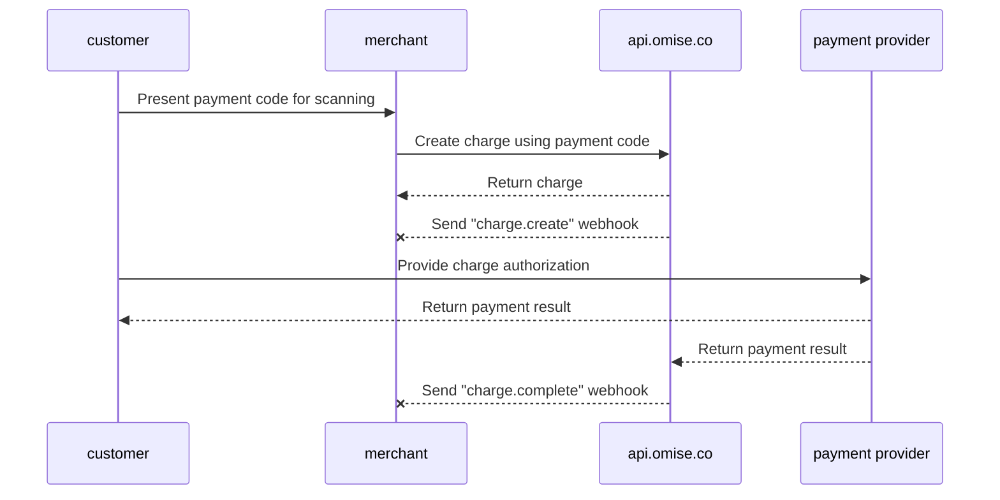

---
---
 # Benutzerpräsentierter Modus Zahlung (B scan C)

<details>
  <summary><em>Themen auf dieser Seite</em></summary>
- [Wie man es aktiviert](#wie-man-es-aktiviert)
- [Zahlungsfluss](#zahlungsfluss)
- [Implementierung](#implementierung)
    - [Erstellen einer Zahlung](#erstellen-einer-zahlung)
- [Einstellen des Verfallsdatums der Zahlung](#einstellen-des-verfallsdatums-der-zahlung)
    - [Abschließen der Zahlung](#abschließen-der-zahlung)
- [Stornierungen und Rückerstattungen](#stornierungen-und-rückerstattungen)
- [Limits](#limits)
- [Verwandte API-Dokumentation](#verwandte-api-dokumentation)
- [Wie man den öffentlichen Schlüssel und den geheimen Schlüssel überprüft](#wie-man-den-öffentlichen-schlüssel-und-den-geheimen-schlüssel-überprüft)
</details>

Akzeptieren Sie Zahlungen vor Ort von Alipay+ Benutzern über Ihr Point-of-Sale-System (POS) mit der Zahlungsmethode **Alipay+ Benutzerpräsentierter Modus Zahlung (B scan C)**.

Dieser Leitfaden führt Sie durch den Zahlungsfluss und beschreibt, wie Sie ihn implementieren.

## Wie man es aktiviert

**Unterstützte Länder:** Thailand, Singapur, Malaysia  
**Minimale API-Version:** `2017-11-02`

| Unterstützte Wallets | Thailand | Singapur | Malaysia |
|----------------------|----------|----------|----------|
| Alipay CN            | ✅       | ✅       |          |
| Alipay HK            | ✅       | ✅       | ✅       |
| KakaoPay             | ✅       | ✅       | ✅       |
| GCash                |          | ✅       | ✅       |
| Touch 'n Go          | ✅       | ✅       |          |
| TrueMoney            |          | ✅       | ✅       |

Um die Benutzerpräsentierte Modus Zahlung (B scan C) zu aktivieren, senden Sie eine E-Mail mit der Anfrage an [support@omise.co](mailto:support@omise.co). Sie müssen die neuen Geschäftsbedingungen überprüfen und akzeptieren.

## Zahlungsfluss

Kunden, die über den Benutzerpräsentierten Modus Zahlung (B scan C) bezahlen, präsentieren ihren Zahlungscode (Strichcode oder QR-Code) an Sie. Um eine Zahlung zu erstellen, müssen Sie den Zahlungscode mit einem Strichcode-Scanner scannen.


1️⃣ Der Kunde öffnet eine unterstützte Alipay+ Wallet auf seinem Mobiltelefon.  
2️⃣ Der Kunde erzeugt dann einen QR-Code in der Wallet-Anwendung und zeigt ihn dem Händler.  
3️⃣ Der Händler scannt den QR-Code mit einem QR-Code-Scanner.  
4️⃣ Der Kunde bestätigt die Zahlung in der Wallet-Anwendung.  
5️⃣ Wenn die Zahlung erfolgreich ist, benachrichtigt die Wallet-Anwendung den Kunden.

## Implementierung

Machen Sie die folgenden API-Anfragen, um eine Zahlung mit **Benutzerpräsentiertem Modus Zahlung (B scan C)** zu erstellen:

1. Erstellen Sie eine neue [Zahlung](/charges-api#create), bei der die erforderlichen Parameter angegeben werden.
2. Nachdem Sie das Abschlussereignis der Zahlung erhalten haben, rufen Sie die Zahlung ab, um ihren Status zu überprüfen (optional, aber empfohlen).

Verwenden Sie Ihren **geheimen Schlüssel**, um die Benutzerpräsentierte Modus Zahlung (B scan C) zu erstellen.

## Erstellen einer Zahlung

Wenn der Zahler bestätigt, dass er diese Zahlungsmethode verwenden möchte, erstellen Sie eine [Zahlung](/charges-api), bei der die folgenden Parameter angegeben werden: `amount`, `currency`, `source[type]` (alipayplus_upm) und `source[barcode]`.

| Parameter            | Typ     | Beschreibung                                                             |
|----------------------|---------|---------------------------------------------------------------------------|
| `amount`             | integer | (erforderlich) Betrag in Untereinheiten der Quellwährung                  |
| `currency`           | string  | (erforderlich) Währung für die Quelle als dreibuchstabiger ISO 4217-Code  |
| `source[type]`       | string  | (erforderlich) Zahlungsmethodenquelle `alipayplus_upm`                     |
| `source[barcode]`    | string  | (erforderlich) Zahlungscode (Strichcode), der mit Ihrem Scanner gelesen wird |

Das folgende Beispiel zeigt, wie eine Zahlung mit curl erstellt wird. Ersetzen Sie `$OMISE_SECRET_KEY` durch den geheimen Testschlüssel, den Sie auf [Ihrer Dashboard-Seite](https://sso-idp.omise.co/realms/engagement/protocol/openid-connect/auth?client_id=dashboard&redirect_uri=https%3A%2F%2Fdashboard.omise.co%2Fv2&state=105360ec-75e1-4633-84ce-37f575a481a9&response_mode=fragment&response_type=code&scope=openid&nonce=bad19825-6662-494c-b3fa-c4f8cb8fb998&ui_locales=en&code_challenge=CzHJ3LuoY9_1i1l3AnT_kyyJV_UIkVKcWnjldQ4S49s&code_challenge_method=S256) finden.

```bash
curl https://api.omise.co/charges \
  -u $OMISE_SECRET_KEY: \
  -d "amount=150000" \
  -d "currency=THB" \
  -d "source[type]=alipayplus_upm" \
  -d "source[barcode]=2897991359827699709"
```

```bash
{
  "object": "charge",
  "id": "chrg_test_611binawoqhcagslthw",
  "location": "/charges/chrg_test_611binawoqhcagslthw",
  "amount": 150000,
  "acquirer_reference_number": null,
  "net": 147352,
  "fee": 2475,
  "fee_vat": 173,
  "interest": 0,
  "interest_vat": 0,
  "funding_amount": 150000,
  "refunded_amount": 0,
  "transaction_fees": {
    "fee_flat": "0.0",
    "fee_rate": "1.65",
    "vat_rate": "7.0"
  },
  "platform_fee": {
    "fixed": null,
    "amount": null,
    "percentage": null
  },
  "currency": "THB",
  "funding_currency": "THB",
  "ip": null,
  "refunds": {
    "object": "list",
    "data": [],
    "limit": 20,
    "offset": 0,
    "total": 0,
    "location": "/charges/chrg_test_611binawoqhcagslthw/refunds",
    "order": "chronological",
    "from": "1970-01-01T00:00:00Z",
    "to": "2024-09-10T03:57:36Z"
  },
  "link": null,
  "description": null,
  "metadata": {},
  "card": null,
  "source": {
    "object": "source",
    "id": "src_test_611binao6nfn751k7e1",
    "livemode": false,
    "location": "/sources/src_test_611binao6nfn751k7e1",
    "amount": 150000,
    "barcode": "2897991359827699709",
    "bank": null,
    "created_at": "2024-09-10T03:57:36Z",
    "currency": "THB",
    "email": null,
    "flow": "offline",
    "installment_term": null,
    "ip": null,
    "absorption_type": null,
    "name": null,
    "mobile_number": null,
    "phone_number": null,
    "platform_type": null,
    "scannable_code": null,
    "billing": null,
    "shipping": null,
    "items": [],
    "references": null,
    "provider_references": null,
    "store_id": null,
    "store_name": null,
    "terminal_id": null,
    "type": "alipayplus_upm",
    "zero_interest_installments": null,
    "charge_status": "pending",
    "receipt_amount": null,
    "discounts": [],
    "promotion_code": null
  },
  "schedule": null,
  "linked_account": null,
  "customer": null,
  "dispute": null,
  "transaction": null,
  "failure_code": null,
  "failure_message": null,
  "status": "pending",
  "authorize_uri": null,
  "return_uri": null,
  "created_at": "2024-09-10T03:57:36Z",
  "paid_at": null,
  "authorized_at": null,
  "expires_at": "2024-09-17T03:57:36Z",
  "expired_at": null,
  "reversed_at": null,
  "zero_interest_installments": false,
  "branch": null,
  "terminal": null,
  "device": null,
  "authorized": false,
  "capturable": false,
  "capture": true,
  "disputable": false,
  "livemode": false,
  "refundable": false,
  "partially_refundable": false,
  "reversed": false,
  "reversible": false,
  "voided": false,
  "paid": false,
  "expired": false,
  "can_perform_void": false,
  "approval_code": null
}
```
## Einstellen des Verfallsdatums der Zahlung

Zahlungen im Benutzerpräsentierten Modus (B scan C), die noch nicht autorisiert wurden (`status=pending`), können sofort auf "abgelaufen" gesetzt werden, wodurch die Zahlung storniert wird:

```bash
curl https://api.omise.co/charges/$CHARGE_ID/expire \
  -X POST \
  -u $OMISE_SECRET_KEY:
```
## Abschluss der Zahlung

Sie haben eine neue Zahlung erstellt, deren `status` auf `pending` gesetzt ist. Weitere mögliche Werte für den Zahlungsstatus sind `successful`, `failed` und `expired`.

Die folgenden Abschnitte erläutern, wie eine Zahlung autorisiert, das Webhook-Ereignis zum Abschluss empfangen und der Status aktualisiert wird.



### Empfang des Ereignisses zum Abschluss der Zahlung

Der beste Weg, um über den Abschluss einer Zahlung benachrichtigt zu werden, ist die Verwendung von [Webhook-Ereignissen](/api-webhooks).

Richten Sie auf dem Server des Händlers einen Ort ein, um Webhook-Ereignisse zu empfangen, und fügen Sie diesen Ort als Webhook-Endpunkt [im Dashboard](https://sso-idp.omise.co/realms/engagement/protocol/openid-connect/auth?client_id=dashboard&redirect_uri=https%3A%2F%2Fdashboard.omise.co%2Fv2&state=53075ccb-f9f2-48cd-86b1-5832abd511b8&response_mode=fragment&response_type=code&scope=openid&nonce=b91aec0e-e4a0-4790-af76-e67a7bf86361&ui_locales=en&code_challenge=05XsRLkTZ9b149JDqFCsB3xXN3-_d9CGS_iCp0SLPy4&code_challenge_method=S256) hinzu.

### Überprüfen des Zahlungsstatus
Nachdem Sie dieses Ereignis erhalten haben, rufen Sie die Zahlung mit ihrer `ID` ab und bestätigen Sie, dass ihr `status` mit dem `status` der Zahlung im Ereignis übereinstimmt.

- Wenn der Wert von `status` auf `successful` gesetzt ist, haben Sie die Zahlung erhalten.
- Wenn der Wert von `status` auf `failed` gesetzt ist, überprüfen Sie den `failure_code` und `failure_message` im Zahlungsobjekt für eine Erklärung.

Mögliche Fehlercodes sind wie folgt:

| Fehlercode            | Beschreibung                                                              |
|-----------------------|--------------------------------------------------------------------------|
| `payment_expired`      | Zahlung abgelaufen.                                                       |
| `payment_rejected`     | Zahlung vom Aussteller abgelehnt.                                         |
| `insufficient_fund`    | Unzureichende Mittel auf dem Konto oder die Zahlungsmethode hat ihr Limit erreicht. |
| `failed_processing`    | Allgemeiner Fehler bei der Zahlungsabwicklung.                            |

## Stornierungen und Rückerstattungen

Sie können Zahlungen im **User-Presented Mode (B scan C)** bis 16:15 UTC am Transaktionsdatum stornieren und teilweise oder vollständige Rückerstattungen innerhalb von einem Jahr nach der Transaktion veranlassen.

## Limits

- **Thailand**:
  - **Mindestbetrag**: `2000` (THB 20.00)
  - **Höchstbetrag**: `15000000` (THB 150.000,00)
- **Singapur**:
  - **Mindestbetrag**: `100` (SGD 1.00)
  - **Höchstbetrag**: `2000000` (SGD 20.000,00)
- **Malaysia**:
  - **Mindestbetrag**: `100` (MYR 1.00)
  - **Höchstbetrag**: `3000000` (MYR 30.000,00)

## Verwandte API-Dokumentation
- [Charge](https://example.com/charge)
- [Source](https://example.com/source)
- [Webhook](https://example.com/webhook)

## Wie man den öffentlichen und geheimen Schlüssel überprüft
Für Informationen zum Abrufen und Überprüfen der öffentlichen und geheimen Schlüssel lesen Sie bitte [dieses Dokument](https://example.com/document).
